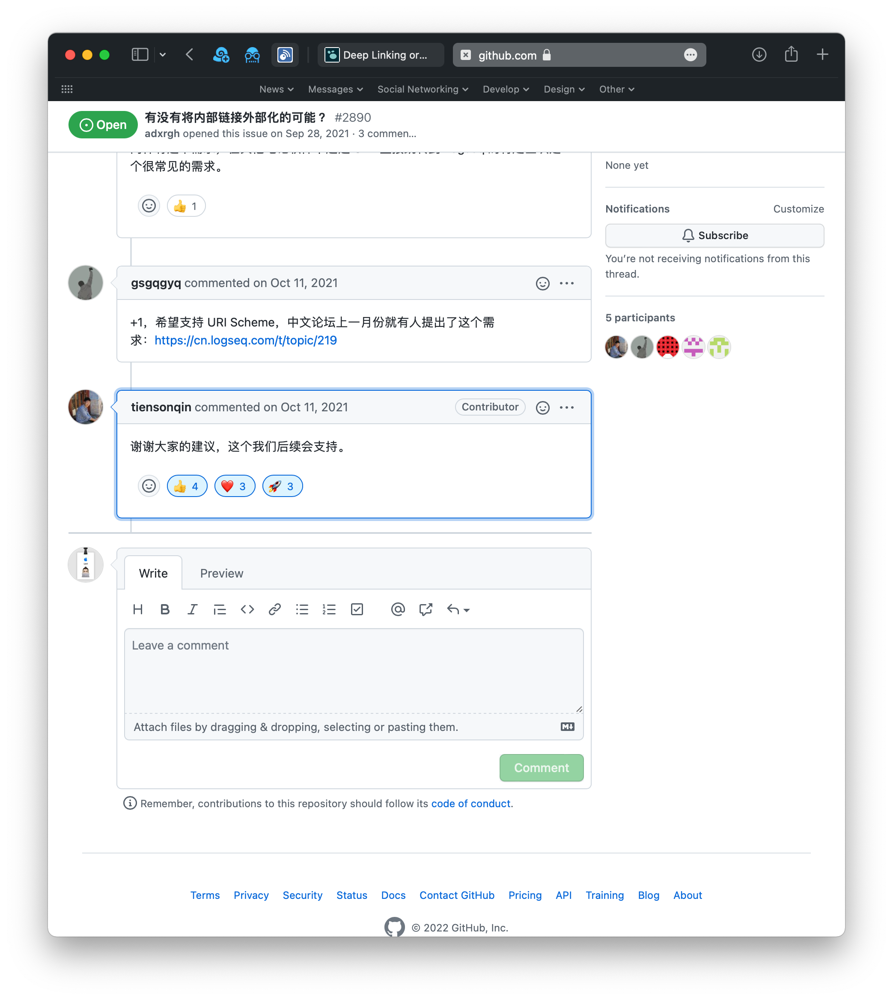

-
- 木子维Levi 02-05 10:39
  LS 有可以使用的 URL scheme 么？例如 Ob 可以用 obsidian:// 这种。
- 木子维Levi 02-05 10:41
  例如我在 LS 里面记了文献笔记，然后希望在 Ob 中记录永久笔记时通过 URL 跳转来引用 LS 里的文献笔记。
- Ws 02-05 11:27
  有 外部有就可以调用
- zotero、everything都有的
- 木子维Levi 02-05 11:27
  我是想在 Ob 里调用 LS 的内容
- 木子维Levi 02-05 11:28
  例如有没有 logseq:// 这种 url
- Ws 02-05 11:31
  可以调网页版的
- 桌面版不清楚
- 你搜一下zotero 搜索引擎 logseq
- 看看是咋实现的
- 木子维Levi 02-05 11:32
  Ws：可以调网页版的
  @Ws 一直用的桌面版 🌚
- Ws 02-05 11:32
  反正可以从zotero跳转到logseq网页端
- 你可以参考下思路
- 
-
- Ws 02-12 09:39
  https://wewe.t9t.io/chat/%E3%80%90%E9%9B%86%E6%99%BA%E3%80%91%E6%B3%A8%E6%84%8F%E5%8A%9B%E4%B8%8E%E7%9F%A5%E8%AF%86%E7%AE%A1%E7%90%86%E7%BE%A4/page/1
- 码一下
- Ws 02-12 09:42
  https://blog.t9t.io/wewe-2019-07-04/