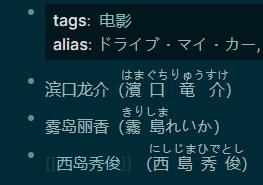
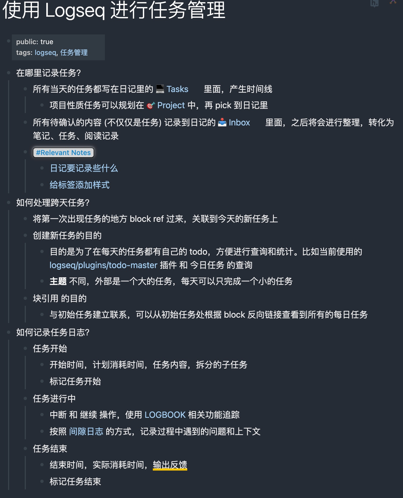
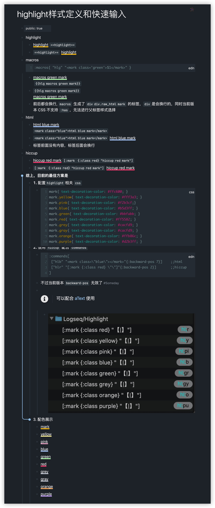

- 视频教程
collapsed:: true
	- 1、小阳读书
	  知识效率博主 B站Up主:Arya_yang 灵感分享记录在Twitter: @yangyangswift
		- https://www.xiaohongshu.com/user/profile/5e7c9b9d00000000010077c1
		- https://space.bilibili.com/16357618/video?tid=188&keyword=&order=pubdate
	- 2、王树义老师
	- 天津师范大学副教授，公众号「玉树芝兰」（nkwangshuyi）
		- https://space.bilibili.com/314022607/channel/collectiondetail?sid=24902
	- 3、社区线上聚会录播，群主推荐，干货多多
		- https://space.bilibili.com/375685451?from=search&seid=8375267588516473488&spm_id_from=333.337.0.0
	- 4、零基础学Logseq——我麋鹿啦丶
		- https://www.bilibili.com/video/BV1qq4y1k7fN?spm_id_from=333.999.0.0
		- https://www.bilibili.com/video/BV1jP4y1A7kQ?spm_id_from=333.999.0.0
	- 5、Logseq从入门到精通——及时春雨
		- https://www.bilibili.com/video/BV1144y14764
- 官方分享
	- [跟 Logseq 的创造者天生聊聊 Logseq 的故事]( https://www.xiaoyuzhoufm.com/episode/61c6cccac525309a443b5b36?s=eyJ1IjogIjYxNmFlZTVhZTBmNWU3MjNiYjhjNzE4MCJ9 )
	- [跟 Logseq 的创造者天生聊聊 Logseq 的故事 ](https://www.xiaoyuzhoufm.com/episode/61c6cccac525309a443b5b36)
- 不知如何使用？看看优秀使用者文章
	- [xutuan/logseq使用经验分享]( https://xutuan.vercel.app/ )
	- [柏林的秋天]( https://logseq.abosen.top/ )
		- [总结了一下 ci的时候修改 index.html以加载自定义脚本的办法](https://logseq.abosen.top/#/page/%E9%85%8D%E7%BD%AE%20logseq%20%E8%87%AA%E5%8A%A8%E5%8F%91%E5%B8%83%E7%9B%B8%E5%85%B3%E6%B5%81%E7%A8%8B)
		- [简单总结了一下logseq发布页面 集成评论系统](https://logseq.abosen.top/#/page/logseq%20%E6%8E%A5%E5%85%A5%E8%AF%84%E8%AE%BA%E7%B3%BB%E7%BB%9F)
		- [:ruby [:rb "Senior"] [:rp "("] [:rt {:style {color "var(--ct-warning-color)"}} "中年"][:rp ")"]]
collapsed:: true
			- 用于标记日语
			- 
		- {:height 814, :width 652}
		- #+BEGIN_QUERY {:title "All page tags" :query [:find ?tag-name :where [?tag :block/name ?tag-name] [(count ?tag-name) ?len] [(< ?len 10)] ] :result-transform (fn [result] (sort-by identity result)) :view (fn [tags] [:div (for [tag (flatten tags)] [: a.tag.mr-1 {:href (str "#/page/" tag)} (str "#" tag)])])} #+END_QUERY
		- 
		-
	- [OKR + GTD + Note => Logseq]( https://www.bmpi.dev/self/okr-gtd-note-logseq/ )
	- [知乎教程: 介绍 Logseq 和 Zotero+Zotfile 联动，管理和同步 PDF及文献]( https://zhuanlan.zhihu.com/p/405764984)
	- http://northnight.gitee.io/logseq-documents/#/page/Contents
-
-