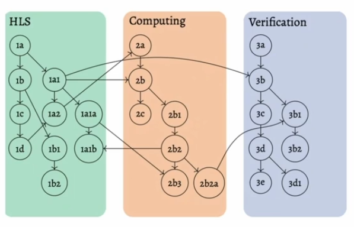
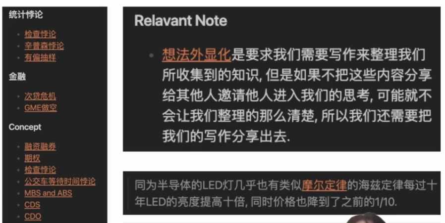
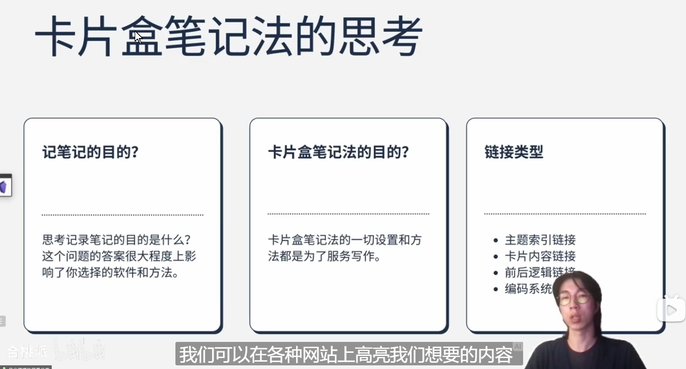
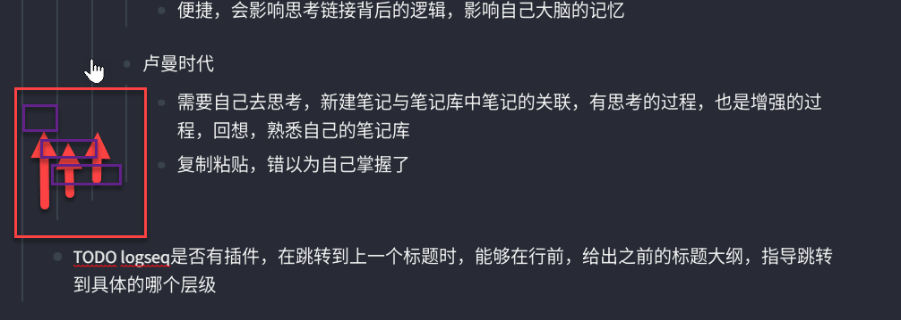
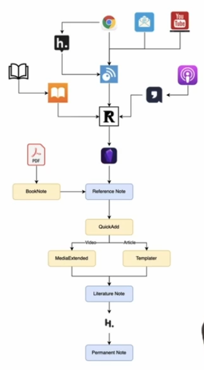
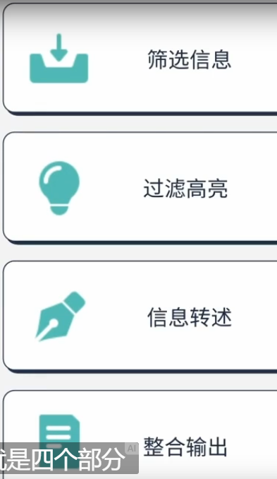
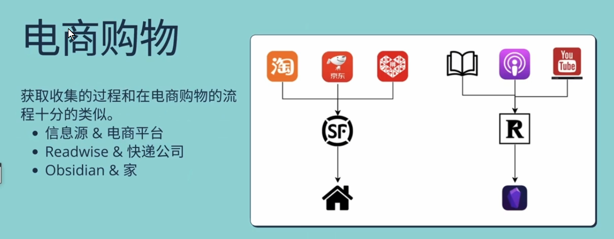
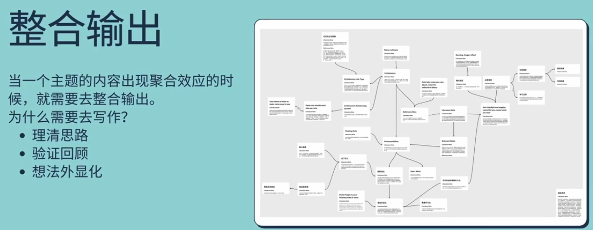
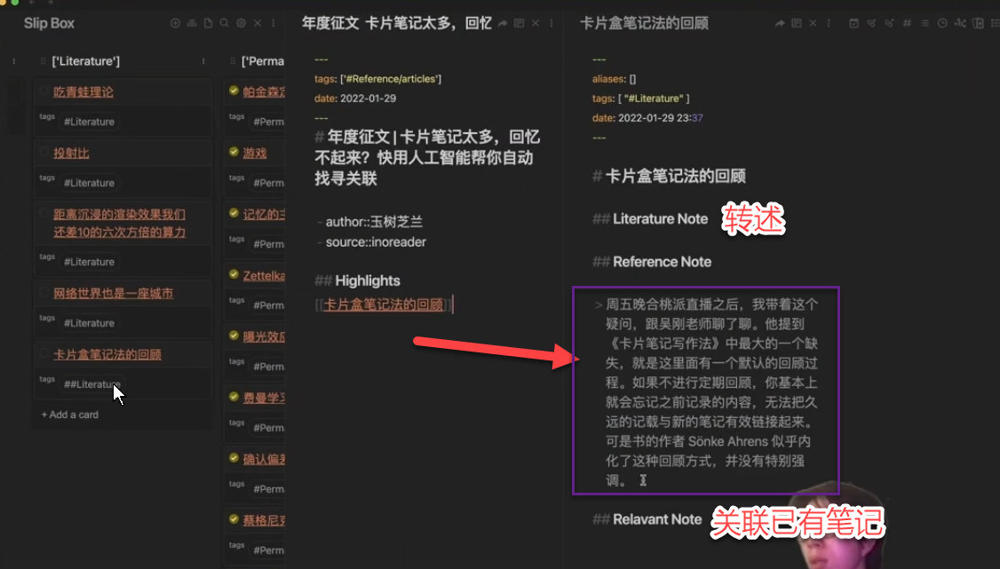
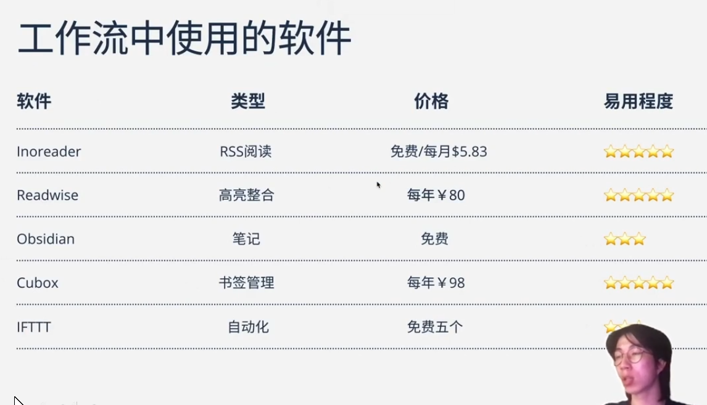

- TODO 加一个query语句，显示本文中的todo（或者在每日日记中）
- TODO 找一个windows的直接呼出命令行，直接输入软件名，打开相应的软件
-
- B 站主播“风尘噗噗啊” 分享视频 https://www.bilibili.com/video/BV173411E7dH
- 归纳总结
- 笔记进化史
	- 1、纸质时代
		- 记录速度不够
		- 检索难
		- 回顾难
		- 前后联系难
		- 找重点难
		- 整合难
		- TODO （logseq快捷键收起二级标题）
	- 2、Ipad时代
		- 好软件
			- goodnotes
			- marginnote
				-
		- 优点
			- 手写
			- 方便插入图片
		- 问题
			- 手写笔记效率低，需要课后花费大量时间，补充笔记
			- 勾画重点内容，输出思维导图，容易导致错以为学会了
			- 单纯高量是没用的
	- 3、电子笔记时代
		- 软件
			- notion
			- roam research
			- remnote，romesek
			- ob
			- heptabase编辑能力不够出色
		- 问题
		- 网络问题，加载慢
	- 卡片盒笔记法和双向链接笔记软件
		- 卡片盒笔记法
			- 为写作服务的方法
		- 双向链接笔记软件
			- 技术实现形式
	- 记笔记的目的
		- 购物清单-备忘录，
		- 日记-回顾-备忘录
		- 笔记方法论
			- 卡片盒笔记法目的很明确，就是为了帮助思考和写作
			- 
			- TODO  logseq快捷键删除一整行
			-
			- 绝大数人使用双链笔记，是为了个人知识管理或学业笔记
			- TODO （缺一个截图软件）
			- 目的与方法论要匹配
			- 不匹配的例子：概念笔记，会产生的链接太多，没有意义的链接
		- 卡片笔记法的链接类型
			- 1、主题索引链接
				- 同一个主题收集很多需要整理，索引
				- 新加入卡片，需要找到合适的主题，归类放入卡片，获得群聚效应
				- 发现同一主题下的笔记联系
			- 2、前后逻辑链接
				- 卡片间的关系索引
				- 使用卡片做输出，能够找到上下文的逻辑
				- 有逻辑，可以快速整理，修饰成文章
			- 3、文本内容链接
				- 卡片内容上的索引，跳出当前主题的逻辑的链接
				- 跳出当前卡片逻辑，或主题间的跳跃链接，发现不同主题下的关系
			- 4、卡片编码链接
				- 卡片思想链的发生过程（受限于当时没有电子化，现在不需要进行这样的管理？可能也需要，挖掘更多功能）
				- TODO 学习双拼，纠正打字的键位与手指控制
				- 思维发生过程，方便后期回顾
				-
			- 
		- 双链笔记的问题
			- 把多种链接形式变成了一种链接形式
			- 同质化的双链笔记软件很多
		-
		- 卡片盒笔记法的思考
			- 
			- TODO  logseq快捷键-创建新一行
			- 时代技术进步
				- 高亮后自动化同步到笔记软件
				- 软件辅助发现潜在的链接，并且一键快速链接
			- 技术进步的问题
				- 高亮的是不是自己理解其中的内容，往往产生错觉
				- 软件发现的未链接，链接了更多，是不是有意义的
				- 图谱越来越复杂，得不到有效的思考信息，只是触觉的满足
				- 便捷，会影响思考链接背后的逻辑，影响自己大脑的记忆
			- 卢曼时代
				- 需要自己去思考，新建笔记与笔记库中笔记的关联，有思考的过程，也是增强的过程，回想，熟悉自己的笔记库
				- 复制粘贴，错以为自己掌握了
	- TODO logseq是否有插件，在跳转到上一个标题时，能够在行前，给出之前的标题大纲，指导跳转到具体的哪个层级
		- 
		  id:: 6202aaee-f663-4af8-b6a5-0f39b2db4859
	- 使用双链实现这四种链接的方式
- 工作流
	- 
-
	- up分享的工作流的构建目的
		- 获得有用的信息
		- 帮助思考
		- 写作
		-
	- 工作流的主要功能归纳
		- 
		-
		- 筛选信息
			- rss 网页快照
		- 过滤高亮
			- 高亮对信息进行过滤
			- readwise处于信息整合与输入到笔记软件中的核心地位
				- 
		- 信息转述
			- 对高亮的信息，需要转述，写下自己的理解，然后与思考自己已有笔记的联系，在相关联的笔记写下相关联的笔记
			- 将建立好的卡片，导入heptabase中进行格式化的链接，暂时结束这个笔记的生命周期
			- 
			- 让链接更有意义
		- 整合输出
		- 
		- 在heptabase，非常方便看到关联起来的卡片的聚合效应，足够多后，就可以考虑写作了
		- 顺着这些卡片的逻辑，整理出文章
		- 写作也能理清这些卡片的思路，同时检验对每个卡片，都充分理解了
		- 写作能暴露出，对于卡片是否完全理解，还能进一步完善卡片
		- 写出的文章，让别人完成理解，检验自己是否理解，费曼学习法
		- TODO logseq对行中文字快速加格式的方法
- 构建自己的工作流
	- 根据抽象出来的概念与步骤，构建自己的工作流
	- 视频中30分钟演示自己的工作
	- TODO logseq对视频具体时间点的标注
	- 将高亮进入自己预先设计的模板下面，进行转述
	- 
	- 链接记忆，才能快速形成长期记忆
	-
- heptabase功能模块与卡片笔记的链接类型的对应关系
-
-
- 人工智能，在不同主题下的卡片关联的局限性
- 跨越主题的链接，往往是灵光一现
-
- 利用heptabase，总结整个直播内容：~https://app.heptabase.com/w/f8e9ed71d7b3a49193332effb58cc404d684c04a10502918b0119d86d1c5f204
-
- 难点
	- 转述
	- 一种双向链接的形式，通过自己的思考，总结与整理，创造多种卡片笔记的链接类型，为这个卡片增加逻辑思考，关联记忆的更多链接的可能，奠定收集信息的在创造的基础。
- 工作流软件的费用总结
- 
-
- 问答互动
	- rss订阅
	- TODO 构建自己的订阅，获得所需信息
	- RSS信息源收集网站 https://issei.notion.site/issei/RSS-Source-RSS-1e1694d953ae4b529142b1128bfef084