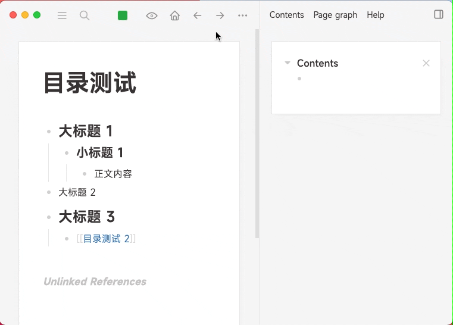
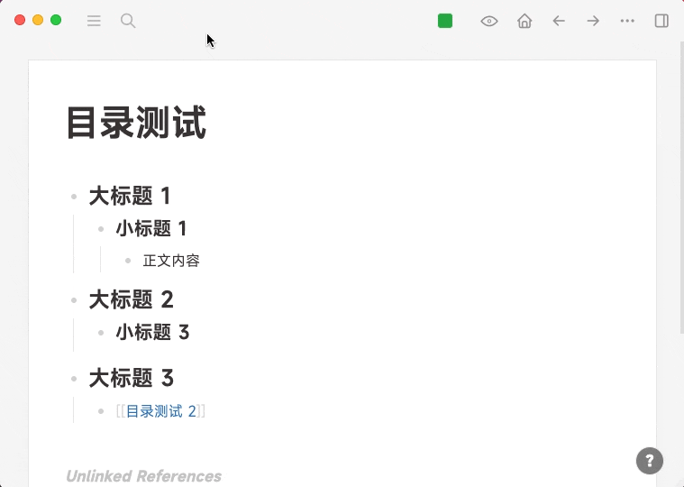

- # logseq-plugin-tocgen
	- github：https://github.com/sethyuan/logseq-plugin-tocgen
	- 在任何地方生成任一页面/块的目录，通过它你可以快速访问页面/块内容。同时提供了滚动回页面顶部的功能。
	- ## 使用展示 (Usage)
		- ### 场景一，动态目录 (Scenario 1, dynamic TOC)
		- 
	- ### 场景二，页面内目录 (Scenario 2, inline TOC)
		- 
	- [[github提issue]]
		-
		-
- #
-